# Kairo AI Event Assistant - Architecture & Design

This document details the system design, components, data contracts, and implementation details of the **Kairo AI Event Assistant** (floating chat drawer and FastAPI recommendation engine middleware).

---

## 🏗️ System Architecture & Interaction Flow

The AI Event Assistant integrates the Next.js client application with the FastAPI event recommendation microservice. It uses Next.js runtime API rewrites to proxy client traffic, avoiding CORS issues and build-time env inlining conflicts.

```mermaid
sequenceDiagram
    autonumber
    actor User as Client Browser
    participant NextJS as Next.js Web App (Node.js runtime)
    participant Backend as FastAPI Recommendation Engine
    participant Gemini as Google Gemini Flash API
    participant DB as Cloud Firestore (Firebase)

    User->>NextJS: Send message via /api/recommendation-proxy/chat
    Note over NextJS: Next.js evaluates rewrite rule at runtime<br/>maps to process.env.RECOMMENDATION_API_URL
    NextJS->>Backend: Forward POST /chat
    
    Backend->>Backend: Parse message for search filters (city, category, status, keyword)
    
    rect rgb(30, 41, 59)
        Note over Backend,DB: Vector Search & Match
        Backend->>Backend: Search active event cache (Cosine Similarity + Proximity Score)
        Backend->>DB: Fetch user profile, bookmarks, and activity log (if userId provided)
    end
    
    Backend->>Gemini: Invoke Gemini API with system instructions + chat history + event context
    Gemini-->>Backend: Return JSON (reply, intent, suggestions)
    
    Backend-->>NextJS: Return JSON payload (reply, events[], suggestions, conversationId)
    NextJS-->>User: Return response
    Note over User: Render reply (Markdown), render event cards,<br/>persist conversationId in localStorage
```



---

## 🎨 Frontend Component Architecture

The frontend is built to be modular, highly responsive, and lightweight. It leverages **dynamic lazy-loading** to prevent bundling heavy Markdown and parsing libraries into standard page loads.

### Component Layering
*   **`ChatProvider` (`src/context/chat-context.tsx`)**: Global React state provider mounted at the root (`layout.tsx`). Tracks whether the chat drawer is open (`isOpen`) and persists the chat open/closed state in `localStorage` across page routing.
*   **`AIAssistant` (`src/components/ai-assistant.tsx`)**: A lightweight Floating Action Button (FAB) launcher with sparkles micro-animations. It renders **only** on the Explore page (`/feed`), floating safely above the mobile bottom navigation bar at `z-[55]`.
*   **`AIAssistantDrawerContainer` (`src/components/ai-assistant-drawer-container.tsx`)**: Global component that listens to `isOpen`. Dynamically imports the heavy drawer component using `next/dynamic` (`ssr: false`) and renders the glassmorphic backdrop.
*   **`AIAssistantDrawer` (`src/components/ai-assistant-drawer.tsx`)**: The full chat drawer interface. Contains chat history, ChatGPT-style typing animations, markdown parsing (`react-markdown` + `remark-gfm`), inline event cards, and auto-focus logic.

---

## ⚙️ Backend Search & LLM Orchestration

The FastAPI backend handles chatbot logic by combining structured vector search with generative AI:

1.  **Filter Parsing**: The incoming query is parsed for filters (e.g. `Bangalore`, `hackathon`, `free`).
2.  **Context Construction**: Active events matching the filters are retrieved from the in-memory cache and ranked using their 4-factor scoring (Cosine similarity, popularity, date proximity, and location matching). The top matches are formatted into a structured text context block.
3.  **Prompt Engineering**: A detailed system instruction prompt is built, instructing Gemini to act as "Kairo AI," use the event context without hallucinating details, and format the output in clean JSON conforming to the `ChatResponse` model.
4.  **Generative Response**: Gemini returns a structured JSON payload which is merged with full event metadata objects and sent to the client.

### Data Contracts (API Specifications)

#### `POST /chat`
**Request Payload (`ChatRequest`):**
```json
{
  "userId": "string | null",
  "conversationId": "string | null",
  "message": "string"
}
```

**Response Payload (`ChatResponse`):**
```json
{
  "intent": "find_events | compare_events | general_help",
  "reply": "string (Markdown formatted text)",
  "events": [
    {
      "id": "string",
      "title": "string",
      "description": "string",
      "category": "string",
      "date": "string (YYYY-MM-DD)",
      "time": "string",
      "location": "string",
      "city": "string",
      "isOnline": "boolean",
      "registrationUrl": "string",
      "bannerImage": "string",
      "views": "integer",
      "saves": "integer",
      "registrations": "integer",
      "status": "active"
    }
  ],
  "suggestions": ["string"],
  "conversationId": "string"
}
```

---

## 🔋 Performance & Connection Safety Design

To guarantee stability under low-tier hardware (e.g. Render Free/Starter) and network glitches, the system employs several safety mechanisms:

| Strategy | Component | Description |
| :--- | :--- | :--- |
| **API Rewrite Proxy** | Next.js Server | Client requests are proxied via `/api/recommendation-proxy` at runtime. Eliminates preflight delays and allows dynamic configuration of the target hostname without re-compiling the Next.js Docker image. |
| **TypeError Catching** | React Chat UI | Catches generic browser `"Failed to fetch"` exceptions (which happen when the backend is offline) and replaces them with: `"Failed to connect to Kairo AI. The recommendation service may be offline or the API URL is unconfigured."` |
| **In-Memory Cache Filtering** | FastAPI Recommender | Expired, past, or inactive events are skipped during embedding sync and **not** stored in memory. This reduces RAM footprint by over 90% (from >800MB to <60MB). |
| **LRU User Cache Eviction** | FastAPI Recommender | Caps the user embeddings cache (`self.user_embedding_cache`) at **200 users** and evicts the oldest entries to prevent unbounded memory growth over time. |
| **Double-Submit Guard** | React Chat UI | Hitting Enter multiple times or clicking send while `isLoading` is true is blocked. The input, send button, and chips are disabled while waiting for responses. |
